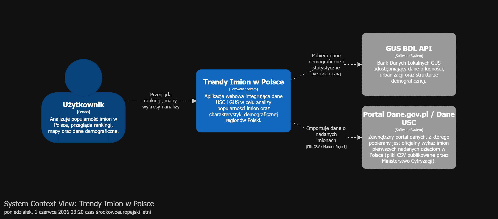
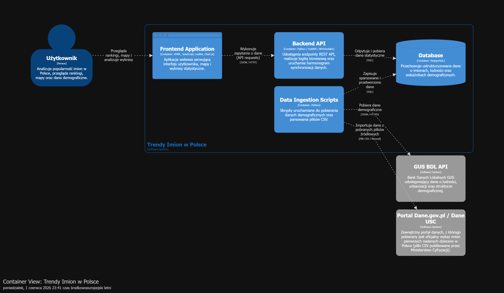
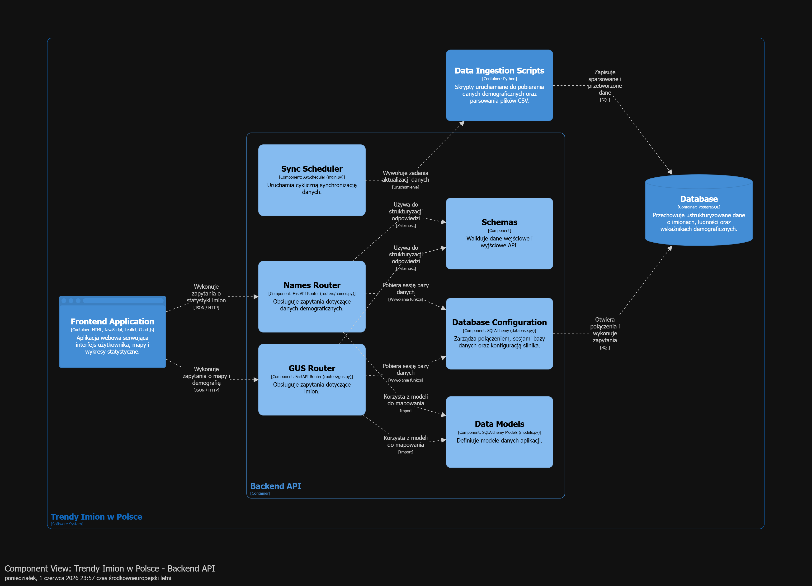
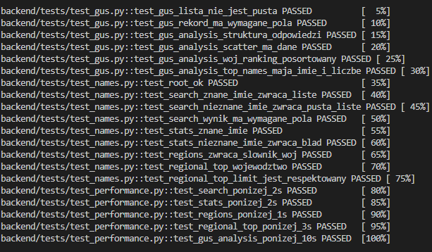
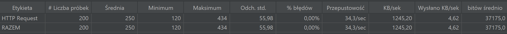

# Trendy imion w Polsce

Celem projektu „Trendy imion w Polsce” jest analiza popularności imion nadawanych dzieciom w Polsce z wykorzystaniem danych pochodzących z rejestrów USC oraz Banku Danych Lokalnych GUS. Aplikacja umożliwia przeglądanie rankingów imion, analizę danych demograficznych oraz prezentację wyników w postaci map i wykresów. System został zaprojektowany jako aplikacja webowa integrująca dane z różnych źródeł i udostępniająca je użytkownikowi w przejrzystej formie.

## 1. Architektura systemu
Projekt został zbudowany w oparciu o architekturę wielowarstwową, w której poszczególne komponenty odpowiadają za określone funkcje systemu. Strukturę aplikacji przedstawiono za pomocą trzech diagramów C4: Context Diagram, Container Diagram oraz Component Diagram.

### Poziom 1: Context diagram
Diagram kontekstowy przedstawia użytkownika systemu oraz zewnętrzne źródła danych, z którymi komunikuje się aplikacja (GUS BDL API oraz Dane.gov.pl).


### Poziom 2: Container diagram
Diagram kontenerów przedstawia strukturę systemu oraz komunikację pomiędzy frontendem, backendem, bazą danych i usługą przetwarzania danych.


### Poziom 3: Component diagram
Diagram komponentów pokazuje wewnętrzną strukturę Backend API oraz współpracę pomiędzy jego najważniejszymi komponentami.


---

## 2. Specyfikacja warstw architektonicznych - stack technologiczny

### Frontend

Odpowiada za prezentację danych użytkownikowi, wyświetlanie map oraz wykresów statystycznych. Został zrealizowany przy użyciu technologii **HTML5**, **CSS3** i **JavaScript**. Do wizualizacji danych wykorzystano biblioteki **Leaflet.js** (wraz z plikami map w formacie GeoJSON/JSON) oraz **Chart.js**.

Technologie frontendowe zostały wybrane ze względu na prostotę implementacji oraz możliwość stworzenia lekkiego, interaktywnego dashboardu bez konieczności instalowania dodatkowego oprogramowania po stronie użytkownika.

### Backend API

Odpowiada za obsługę zapytań użytkowników, udostępnianie danych poprzez REST API oraz realizację logiki aplikacji. Został zaimplementowany w języku **Python** z wykorzystaniem frameworka **FastAPI**. Automatyczna synchronizacja danych realizowana jest przy użyciu **APScheduler**.

FastAPI zostało wybrane ze względu na automatyczne generowanie dokumentacji Swagger/OpenAPI, natywną integrację z Pydantic do walidacji danych oraz czytelną składnię. APScheduler pozwala zdefiniować dokładny harmonogram odświeżania danych (1. dnia każdego miesiąca o 3:00 UTC) bez potrzeby stosowania zewnętrznych narzędzi.


### Warstwa dostępu do danych

Odpowiada za komunikację z bazą danych oraz walidację danych przesyłanych przez API. Wykorzystuje biblioteki **SQLAlchemy** oraz **Pydantic**.

SQLAlchemy zostało wybrane, ponieważ pozwala operować na obiektach zamiast pisać surowe zapytania SQL, co zwiększa czytelność kodu. Pydantic zapewnia walidację i serializację danych — modele odpowiedzi definiują dokładną strukturę danych zwracanych przez API.


### Baza danych

Odpowiada za przechowywanie danych o imionach oraz danych demograficznych wykorzystywanych przez system. Zastosowano relacyjną bazę danych **PostgreSQL**.

PostgreSQL został wybrany ze względu na stabilność, obsługę zapytań SQL stosowanych w endpointach oraz natywną obsługę w ekosystemie Docker.

### Moduł pobierania danych (Data ingestion)

Odpowiada za pobieranie, przetwarzanie i zapisywanie danych pochodzących z plików CSV oraz API GUS. Został zaimplementowany w języku **Python** z wykorzystaniem bibliotek **pandas** i **requests**.

Python został wybrany ze względu na wygodne przetwarzanie danych CSV i JSON, znajomość składni oraz łatwą integrację z SQLAlchemy. Moduł stosuje wzorzec upsert — przy ponownym uruchomieniu nie tworzy duplikatów rekordów.

### Konteneryzacja

Wszystkie komponenty systemu uruchamiane są w kontenerach **Docker**, natomiast ich konfiguracja i zarządzanie realizowane są za pomocą **Docker Compose**.

Docker został wybrany, ponieważ umożliwia uruchamianie projektu w identycznym środowisku na różnych komputerach oraz izolację zależności poszczególnych komponentów. Projekt udostępnia oddzielne konfiguracje dla środowisk dev, test i prod.

---

## 3. Przetwarzane dane i integracja z zewnętrznymi źródłami

System wykorzystuje dane pochodzące z dwóch oficjalnych źródeł publicznych.

### 1. Dane.gov.pl (Ministerstwo Cyfryzacji / USC)

Źródłem danych jest plik CSV zawierający wykaz imion pierwszych nadanych dzieciom w Polsce w 2024 roku.

**Przetwarzane dane:**

* imię dziecka,
* płeć (M/K),
* liczba nadań danego imienia.

Dane są importowane do bazy PostgreSQL i wykorzystywane do tworzenia rankingów oraz analiz popularności imion.

### 2. Bank Danych Lokalnych GUS

Źródłem danych są pliki statystyczne oraz dane pobierane z API GUS.

**Przetwarzane dane:**

* nazwy województw i powiatów,
* liczba mieszkańców poszczególnych powiatów,
* wskaźnik obciążenia demograficznego określający relację między ludnością w wieku nieprodukcyjnym i produkcyjnym,
* dane przestrzenne wykorzystywane do prezentacji wyników na mapach.

Dane są przetwarzane i łączone z warstwami mapowymi wykorzystywanymi przez aplikację do prezentacji wyników na mapach.

---

## 4. Dokumentacja API i logi

### Dokumentacja API

Interaktywna dokumentacja REST API generowana automatycznie przez FastAPI (Swagger UI) dostępna jest pod adresem: [http://localhost:8000/docs](http://localhost:8000/docs)


### Logi

System wykorzystuje logowanie przy użyciu modułu `logging`. Logi służą do monitorowania cyklicznych aktualizacji danych, diagnostyki błędów połączeń z zewnętrznymi API oraz debugowania aplikacji.

Podgląd logów kontenerów:

```bash
docker logs project-backend-1
docker logs project-data_ingestion-1
```

## 5. Uruchomienie aplikacji

### Wymagania

* Docker
* Docker Compose

### Uruchomienie projektu

1. Sklonuj repozytorium:

```bash
git clone <repo_url>
cd Trendy-imion-w-Polsce/project
```

2. Utwórz plik `.env` w katalogu `project/` z następującą zawartością:

```env
POSTGRES_USER=postgres
POSTGRES_PASSWORD=postgres
POSTGRES_DB=namesdb
```

3. Uruchom aplikację:

```bash
docker compose up --build
```

Aplikacja będzie dostępna pod adresami:

* Frontend: `http://localhost:8080`
* Dokumentacja API: `http://localhost:8000/docs`

### Środowiska

#### Development

```bash
docker compose -f docker-compose.yml -f docker-compose.dev.yml up --build
```

Tryb deweloperski uruchamia backend z hot-reload oraz udostępnia port bazy danych na hoście.

#### Test

```bash
docker compose -f docker-compose.yml -f docker-compose.test.yml up --build
```

Środowisko testowe korzysta z oddzielnej bazy danych `namesdb_test` i automatycznie uruchamia zestaw testów pytest.

#### Production

```bash
docker compose -f docker-compose.yml -f docker-compose.prod.yml up --build
```

Środowisko produkcyjne uruchamia kontenery z polityką `restart: always` i danymi dostępowymi z pliku `.env`.

---

## 6. Testowanie aplikacji

### Testy jednostkowe

Do testowania wykorzystano bibliotekę pytest. Testy obejmują:

* dostępność i strukturę odpowiedzi wszystkich endpointów,
* wyszukiwanie znanych i nieznanych imion,
* walidację pól odpowiedzi (typy, wymagane klucze),
* kolejność sortowania wyników,
* endpointy `/names/search`, `/names/stats`, `/names/regions`, `/names/regional-top`, `/gus/analysis`.



### Testy wydajnościowe — pytest

Testy wydajnościowe zaimplementowane są w pytest i sprawdzają, czy każdy endpoint odpowiada w dopuszczalnym czasie:

| Endpoint | Maksymalny czas odpowiedzi |
|---|---|
| `GET /names/search` | 2,0 s |
| `GET /names/stats` | 2,0 s |
| `GET /names/regions` | 1,0 s |
| `GET /names/regional-top` | 3,0 s |
| `GET /gus/analysis` | 10,0 s |

### Testy wydajnościowe — Apache JMeter

Do testowania wydajności pod obciążeniem równoległym wykorzystano narzędzie Apache JMeter.

Konfiguracja testu:
- 10 równoległych użytkowników,
- 20 iteracji,
- łącznie 200 żądań,
- testowany endpoint: `GET /names/search?imie=ANNA`.

Wyniki:

| Metryka | Wartość |
|---|---|
| Liczba żądań | 200 |
| Średni czas odpowiedzi | 250 ms |
| Minimalny czas odpowiedzi | 120 ms |
| Maksymalny czas odpowiedzi | 434 ms |
| Odchylenie standardowe | 55,98 ms |
| Procent błędów | 0,00% |
| Przepustowość | 34,3 żądań/s |

System poprawnie obsłużył równoległe zapytania bez błędów i utrzymał stabilny czas odpowiedzi.



---

## 7. Podział zadań w zespole

**Ada Wojterska:**
1. Inicjalizacja struktury projektu.
2. Integracja z API GUS - dobór zmiennych i parametrów zapytań.
3. Modele bazy danych (SQLAlchemy) oraz moduł ładowania danych.
4. Diagramy C4 (Context, Container, Component).
5. Scheduler (automatyczne odświeżanie danych).

**Alicja Przeździecka:**
1. Przetwarzanie kodów TERYT do 4-cyfrowych identyfikatorów powiatów.
2. Przygotowanie plików GeoJSON granic powiatów i województw.
3. Konfiguracja kontenerów Docker i środowisk (dev, test, prod).
4. Implementacja frontendu.
5. Testy jednostkowe.

**Wspólne:**
1. Wybór tematyki projektu i znalezienie źródeł danych.
2. Projekt i zawartość interfejsu użytkownika.
3. Implementacja Backend API.
4. Testy wydajnościowe.
5. Dokumentacja i README.
